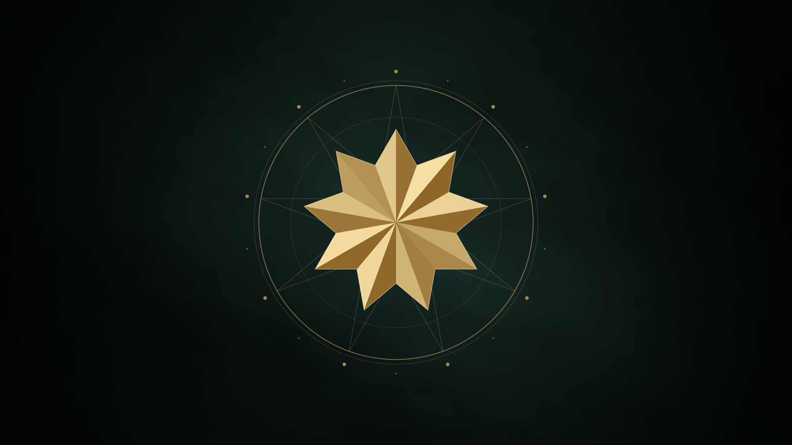

# Bahá'í theme for Omarchy

Mount Carmel after dark. Dome gold on cypress black, with the pale stone of the
Shrine of the Báb for text and the teal of its mosaics in the window borders.



## Install

```bash
omarchy theme install https://github.com/ninepointlabs/omarchy-bahai-theme
```

That clones it into `~/.config/omarchy/themes/bahai` and applies it. It then
appears in the picker as **Bahai**, and you can come back to it any time with:

```bash
omarchy theme set bahai
```

From a checkout, `./install.sh --apply` does the same without the clone.

For the matching boot and disk-unlock screen (the gold star on cypress black):

```bash
omarchy plymouth set by theme bahai
```

## Backgrounds

Five, all 3840x2160. Cycle them with `omarchy theme bg next`.

| File | |
|------|--|
| `1-star.png` | The nine-pointed star, gilded, in a ring of nine and eighteen beads. The default. |
| `2-shrine.jpg` | The Shrine of the Báb lit at night, seen from Yefe Nof Street. |
| `3-terraces.jpg` | The Terraces climbing to the Shrine at night. |
| `4-unity.png` | The star over *"The earth is but one country, and mankind its citizens."* |
| `5-carmel.jpg` | The gardens by day, looking down the mountain to the Bay of Haifa. |

## Palette

| Role | Colour | |
|------|--------|--|
| Accent | `#D9AE5B` | dome gold |
| Background | `#0F1715` | cypress at night |
| Foreground | `#ECE4D0` | Chiampo stone |
| Cyan | `#4FA89A` | the mosaic panels on the drum |
| Red | `#C9503F` | geraniums |
| Orange | `#D48A4E` | crushed-tile paths |
| Blue | `#5286BA` | the Mediterranean |
| Magenta | `#B97AA9` | bougainvillea |
| Window border | gold into teal, 45° | |
| Icons | `Yaru-prussiangreen` | |

See [`colors.toml`](colors.toml) for the full set.

## Rebuilding the wallpapers

The repository ships the finished backgrounds, so this is only needed if you
want to change them.

```bash
./fetch-assets.sh        # re-download the photographs and fonts, if you have cleared assets/
./build-wallpapers.sh    # draw the star, set the type, crop the photographs
./install.sh --apply
```

Requires ImageMagick 7, librsvg and python3. `star.py` draws the star as SVG:
the {9/3} figure of three interlaced triangles, each point split into a lit and
a shaded facet, over a {9/4} line star. Change `LIGHT_FROM` or the golds there
to re-gild it. The fonts are used straight from `assets/fonts/` through a
private fontconfig file, so nothing is installed.

## Credits

The photographs are from Wikimedia Commons under CC BY-SA, by Chris English,
Dani Lavi and Ipho19. The type is Cormorant Garamond and Cinzel (SIL Open Font
License). See [`assets/SOURCES.md`](assets/SOURCES.md) for each file, its
author, licence and source page, and [`LICENSE`](LICENSE) for what the MIT
licence here does and does not cover.

This is an unofficial theme, not produced or endorsed by any Bahá'í
institution. The Greatest Name and the Ringstone symbol are left out on
purpose: they are held sacred, and the nine-pointed star is the symbol meant
for general use.
